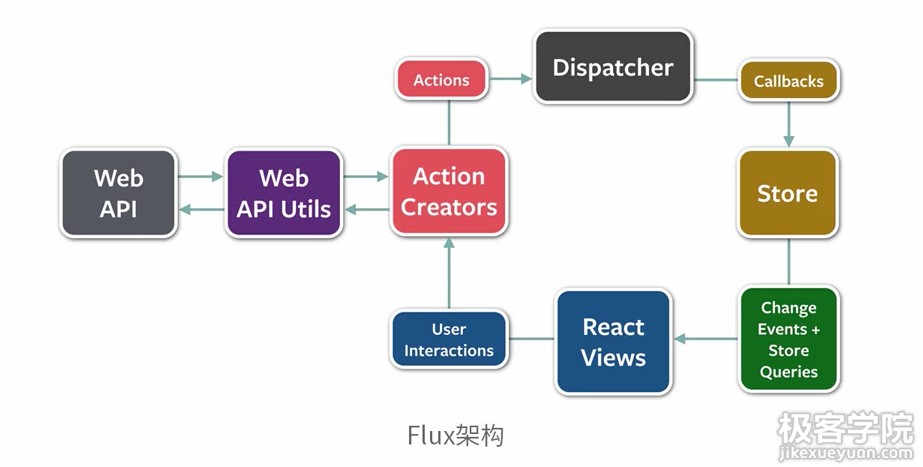
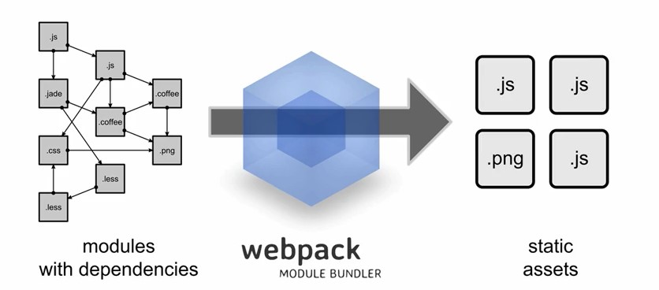

###前端开发库和开发工具简介
* common.js
commonjs的写法，模块化写法，把一些通用的模块全部写在一个common.js的文件中，类似java的util工具类，通过require，相当于java的import引入common.js中的不同模块的function，也可以引入不同的js文件
* require.js
* nodeJS
###React相关库
* jest
* ImmutableJS
* Flux
###前端开发工具介绍
* gulp
* Browserify
* webpack
模块化开发js，根据设计把function模块化，在不同的js中在头部require进一个来，例如在a.js的开头：
var moduleA = require('abc.js') 
表示要引入abc.js作为依赖，此时abc.js就可以调用moduleA中的方法
极多插件基于nodeJS，所以要先下载nodeJS，但是因为要翻墙的原因，所以要在配置一个nodejs的淘宝镜像，一般使用cnpm

###React的单元测试工具
Facebook开发的一个js库，能够在JS中实现不可变对象。用于性能优化
一般来说，在js中给一个变量赋值了一个对象，这个变量的属性改变了，相应的对象也会改变，因为他们赋值的是对象的指针（引用）。不可变对象则是当把一个对象赋值给一个变量的时候，他会把对象复制一份（不会很傻的整个对象复制，共享结构算法），然后复制的赋值给变量，变量被修改后，修改的只是复制的对象，原有的对象不变。
不可变对象可以大大提高对象比较性能，用于状态和属性判断非常有效
两个对象对比，底层直接对比指针即可

###Flux不是一个框架，是Facebook提出的一种代码架构
React只是一个视图库，Flux是在React基础上对于前端整体的组织方案
传统的MVC只适用于中小型系统，对大规模系统来说MVC复杂度过高，改了一个M，可能很多依赖都要修改
Flux的目的是保证逻辑清晰，数据流向清晰，依赖关系清晰

####前端分为四大模块：
React Views（视图模块），ActionCreators（操作层模块），Dispatcher（大脑模块），Store（存储模块）；
Web API Utils、Web API则是后端模块
####框架流程：
在React Views，视图发生改变，如用户在表单中输入内容，产生了用户操作User Interactions，传到了ActionCreators，它跟后端Web API Utils、Web API进行交互后，产生actions传给大脑Dispatcher，里面包含action类型等一些数据，然后通过store的callbacks函数（每个生成的store都生成callbacks函数，给大脑调用，此处大脑并不关心是哪个action传过来，只知道把action传给所有的store，因为一个action可能会影响多个store，所以干脆传到所有store，只要store关注这个action，那么你就取到这个action）传给所有的store，store根据action作出相应改变后，此处可能是某个store作出了改变，然后他就会广播我收到了action（同样的因为store也不知道他的改变会影响到哪个view，所以干脆进行广播，只要那个view关注这个改变，他也就作出改变），store的改变广播后，只要这个view关注，他就接收这个改变后的store，然后给自己的属性和状态进行更改，从而导致view进行改变更新。

###gulp+react
一个nodejs的项目构建工具，建议安装时每个项目单独下载模块，不要搞成全局，因为他会自动更新模块版本，导致出现全局模块冲突等问题，易学易用高效，流式处理，第一次处理后，下次处理都是在内存中进行
####安装：
cnpm install gulp
//把jsx文件转换成js
//--save 把下载的模块信息也配置到当前项目的package.json文件中，git提交的时候就不用提交node_modules文件夹（相当于maven的配置文件，不用提交jar包到版本控制库中）
//还有另外一个--save-dev 开发版本和产品版本的区别，开发版本可能包含更多的测试模块或者是打包插件模块，而产品版本只包含需要的模块
cnpm install gulp-react --save

###功能：
把代码转换成浏览器通用的标准代码，生成出代码文件，例如把新标准的sass/scss（css3新标准）文件转换成css文件，或者把jsx文件（react的jsx语法文件）转换成js文件，保存到指定目录；或者结合其他插件压缩代码，混淆代码
本身只是一个执行框架，执行什么需要结合browserify和webpack，就是编写function中的内容

###使用：
gulp.task('sass',function(){
    //src读入内容，pipe把上一步结果传到下一步，sass就是一个插件，把scss文件转换成标准css文件
    gulp.src('./sass/**/*.scss').pipe(sass().on('error',sass.logError)).pipe(gulp.dest('./css'));
})

###浏览器端代码模块化工具
服务器端nodejs自带模块功能，使用require和module.exports构建项目，平时我们要根据js的依赖来按顺序引入js，但是有模块化之后就可以像后端一样，在js开头先引入js模块，之后就可以调用模块里面的内容，但是浏览器端没有这种功能
原理：部署时处理代码依赖，将模块打包到一起
根据js的依赖关系，打包成单个js文件
###存在问题：
暂时不用到的代码也会被打包，体积大，首次加载慢；
只要一个模块更新，整个文件缓存失效；
###解决方案：
设置entry point，入口点技术
不同页面设置不同入口点，所以就不要加载对方的js文件

简单说代码打包和预处理（在服务器端先运行），加强版browserify，使用在大型单页应用

webpack把png等资源也包含；自动生成类似browserify的entry point，不用手动生成，自动完成
code splitting（自动生成，不需要手动）和loader（处理各种类型的静态文件，并且支持串联操作）

