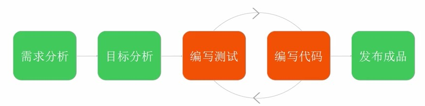

###开发流程介绍
####分析目标
####项目流程
1. 构建项目，安装模块包
2. 安装模块
3. 编写代码（TDD模式，先写测试代码）
4. 实现功能
5. 测试
6. 发布
---

* TDD：Test-driven development 测试驱动开发
先写测试，再进行开发，用测试驱动开发和重构。
各种驱动开发：
* DDD，设计驱动开发
* BDD，行为驱动开发
* FDD，特性驱动开发
* HDD，假设驱动开发，根据想法

TDD：测试驱动开发
先写测试再进行开发，先明确目标再进行开发，把目标明确到某个功能，某个函数

React最适合也是最核心的场景就是开发widget，或者说组件。
大型的React项目本质上就是由widget堆积而成的。

cnpm init（初始化项目，名字只能中文）
设置项目名，描述，js入口点，git仓库等信息，然后会自动生成一个package.json，后面的模块安装时加上--save则把信息写到package.json文件中

cnpm install *** --save
然后package.json就会出现相关模块

